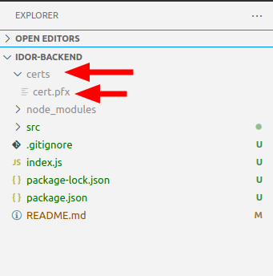

# idor-backend

Projeto destinado ao server side do aplicativo.

# Configuração

Necessário criar uma pasta **certs** dentro do projeto, na raiz, e dentro dessa pasta colar o certificado .psx nomeado como **cert.pfx**.



Depois de configurado o certificado na pasta correta com o nome correto, basta instalar as dependencencias:

``` bash
npm install
```

# Inicializar o servidor

Após a etapa de configuração, basta:

``` bash
npm run start
```

# Dependencia RNDS

Esse projeto usa a lib [RNDS](https://www.npmjs.com/package/rnds) oficial do ministério da saúde. Para exemplos e mais informações é só acessar a página.